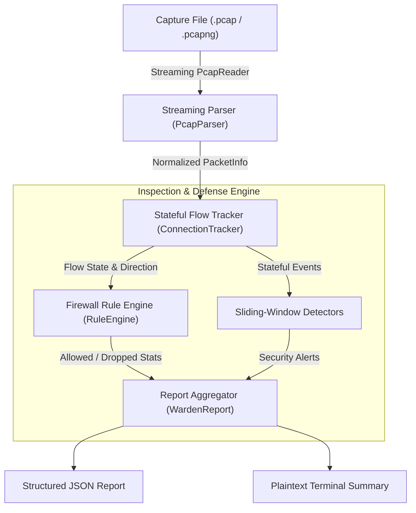
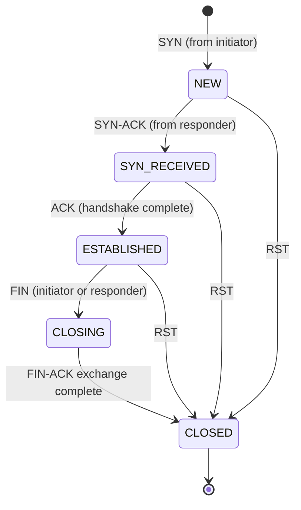

# PacketWarden

[](https://github.com/shashankd06/PacketWarden-Python-Firewall-Engine/actions)


**PacketWarden** is an offline packet capture (`.pcap`/`.pcapng`) analysis tool, stateful firewall rule engine, and network intrusion detection system built with Python and Scapy.

Designed for systems, infrastructure, and network security roles, PacketWarden demonstrates core systems networking concepts: memory-bounded streaming dissection, canonical bidirectional connection tracking, first-match-wins access control, and sliding-window attack detection algorithms.

> **Offline Inspection Only:** PacketWarden strictly inspects capture files. It does not sniff live traffic, send packets, or access the external network at runtime.

---

## Architecture

PacketWarden processes packets using a streaming pipeline where raw PCAP frames are normalized, tracked in a bidirectional flow table, evaluated against ordered firewall policies, and correlated through sliding-window attack detectors.



---

## Stateful Connection Tracking

In stateless firewalls, permitting an outbound connection requires opening high-port inbound reply holes. In contrast, PacketWarden implements **stateful inspection**:
1. Bidirectional traffic is normalized into an order-independent canonical 5-tuple key: `(proto, min(ip1, ip2), min_port, max(ip1, ip2), max_port)`.
2. Outbound traffic initiated according to local policy transitions through a finite state machine:
   `NEW` (SYN seen) &rarr; `SYN_RECEIVED` (SYN-ACK) &rarr; `ESTABLISHED` (Handshake ACK) &rarr; `CLOSING` (FIN) &rarr; `CLOSED` (FIN-ACK / RST).
3. **Stateful Filtering Rule:** Reply traffic from an established or closing connection initiated in an allowed direction is automatically permitted.
4. **Unsolicited Drop:** Any inbound non-SYN packet (e.g. unsolicited `ACK`, `FIN`, or data) that has no corresponding state in the tracking table is dropped as an unsolicited packet.



### UDP Flow Tracking (Pseudo-State Approximation)
Unlike TCP, UDP is fundamentally **connectionless**: it has no handshakes (`SYN`/`ACK`), sequence numbers, or explicit teardowns (`FIN`/`RST`). Therefore, UDP "state" in any stateful firewall is an **approximation** based entirely on time:
1. **Flow Initiation:** When an outbound UDP packet matches an `ALLOW` firewall rule, a bidirectional flow entry (`UdpFlow`) is inserted into the table keyed by its canonical 5-tuple.
2. **Stateful Reply:** While the flow remains active, return packets from the destination are permitted automatically without requiring an explicit inbound rule.
3. **Timeout Expiration:** Because UDP has no explicit close signal, flows are considered expired after an idle timeout. PacketWarden uses a configurable idle timeout (default `30s`, with a tighter `5s` timeout for DNS on port 53). New packets matching the flow refresh its `last_seen` timestamp.
4. **Unsolicited UDP:** Inbound UDP packets without an active flow are evaluated against the default firewall policy.

### Table Bounding & Eviction
To prevent Denial of Service (state table exhaustion), the table is capped to a configurable size (default `100,000` entries) using an `OrderedDict` with Least-Recently-Used (LRU) eviction. Connections that exceed the idle timeout (`300s`) or half-open handshake timeout (`30s`) relative to packet timestamps are purged.

---

## Attack Detectors

PacketWarden features 3 streaming detectors using sliding windows backed by `collections.deque` with bounded memory:

| Detector | What It Detects | Threshold & Rationale | Severity |
| :--- | :--- | :--- | :--- |
| **PortScanDetector** | Horizontal sweeps & vertical port scans | Contacts &ge; 15 distinct ports or hosts within 10s. Distinguishes stealth SYN scans (&ge;80% pure SYNs) from legitimate applications (which complete handshakes). | HIGH (SYN) / MEDIUM |
| **SynFloodDetector** | TCP SYN half-open resource exhaustion | &ge; 50 SYNs targeting a destination within 5s with completion ratio &le; 15%. Normal traffic completes handshakes; attack bursts leave states half-open. | HIGH |
| **DnsAnomalyDetector** | Data exfiltration & DNS tunneling | 1. Query length > 65 chars (RFC 1035 label limit is 63 chars; exfiltration payload indicator).<br>2. Rate &ge; 30 queries/10s per host.<br>3. &ge; 15 distinct subdomains under same parent domain within 10s (tunneling heuristic). | HIGH / MEDIUM |

---

## Getting Started

### Installation
Python 3.11+ is required.

```bash
git clone https://github.com/shashank/packetwarden.git
cd packetwarden
pip install -e .
```

### Quick Run
Analyze the included sample capture with the example ruleset:

```bash
python -m packetwarden analyze examples/sample_capture.pcap --rules examples/rules.txt --report out.json
```

Output:
```text
======================================================================
                  PACKETWARDEN ANALYSIS REPORT                  
======================================================================
Capture File: examples/sample_capture.pcap
Packets Processed: 41 / 41 (Non-IP: 0, Malformed: 0)
----------------------------------------------------------------------
FIREWALL EVALUATION:
  Allowed Packets:        24
  Blocked Packets:        17
  Stateful Flow Matches:  9
  Rule Match Breakdown:
    - [  10] ALLOW tcp 192.168.1.0/24:any -> any:80,443
    - [   4] ALLOW udp 192.168.1.0/24:any -> 8.8.8.8:53
    - [   1] ALLOW icmp 192.168.1.0/24:any -> any:any
----------------------------------------------------------------------
TRAFFIC PROFILE (TOP TALKERS):
  Top Sources:      203.0.113.55 (17), 93.184.216.34 (5), 192.168.1.15 (4), 8.8.8.8 (4)
  Top Destinations: 192.168.1.1 (17), 93.184.216.34 (10), 8.8.8.8 (4), 192.168.1.15 (4)
  Top Dst Ports:    443 (10), 53 (4), 40000 (1), 40001 (1)
----------------------------------------------------------------------
CONNECTION TRACKING:
  Active States in Table:  22
  Expired Flow States:     4
----------------------------------------------------------------------
SECURITY ALERTS DETECTED (1 total):
  1. [HIGH]   PortScanDetector from 203.0.113.55 at t=1700000025.75s
     Details: SYN Port Scan detected: 203.0.113.55 targeted 15 distinct ports across 1 hosts within 10.0s (SYN ratio: 100%).
======================================================================
```

---

## Performance & Benchmark

Benchmark executed on Windows, Python 3.14 on an offline synthesized capture:
- **Measured Packets:** 10,000 packets
- **Processing Time:** 115.04 seconds
- **Throughput:** **86.9 packets/second** (pure Python Scapy parsing + flow tracking + 3 sliding-window detectors)

---

## Threat Model and Limitations

### What PacketWarden Detects / Protects:
- Enforces strict egress/ingress IP and port access control policies.
- Automatically permits legitimate return flows without opening permanent inbound holes.
- Drops out-of-order unsolicited packets lacking established state.
- Identifies scanning sweeps, SYN flood half-open volumetric attacks, and DNS tunneling/exfiltration.

### Known Limitations:
1. **IPv6:** Current implementation parses and tracks IPv4 only; IPv6 packets are accounted for under `non_ip_packets`.
2. **IP Fragmentation:** PacketWarden does not reassemble fragmented IP packets (vulnerable to fragmentation overlap evasion).
3. **TCP Sequence Validation:** Does not validate 32-bit TCP sequence numbers or ACK validation windows (vulnerable to in-window spoofing).
4. **Application Layer Payloads:** Deep packet inspection (DPI) for encrypted TLS/HTTPS payload inspection is not performed.
